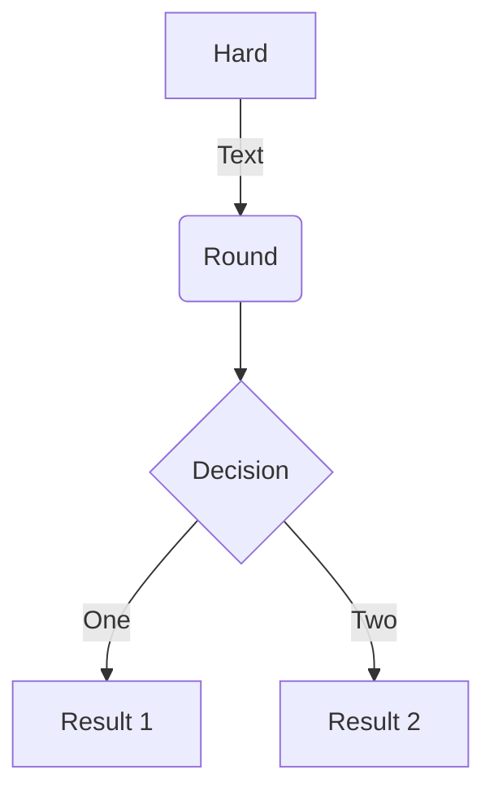

[Old blog](https://leonid-dubinsky.blogspot.com)

See [[Jekyll]], where the sordid saga started.

- ask Obsidian developers to make file moves visible to Git if the vault is a Git repository

```mermaid
flowchart TB

A[Hard] -->|Text| B(Round)
B --> C{Decision}
C -->|One| D[Result 1]
C -->|Two| E[Result 2]
```

