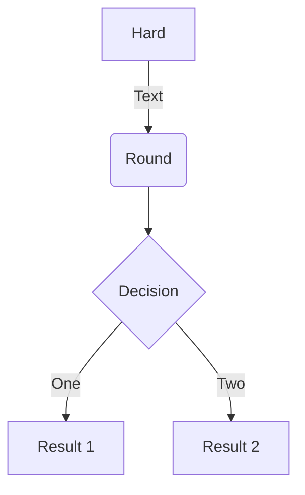

[Old blog](https://leonid-dubinsky.blogspot.com)

See [[Jekyll]], where the sordid saga started.

- ask Obsidian developers to make file moves visible to Git if the vault is a Git repository




## Jekyll finally pissed me off

When I listed TODO link  unresistable to any programmer urge to
write certain kinds of systems, I neglected to mention
a static site generator.

I've been using Jekyll since I migrated my blog from Blogger TODO when;
I then moved my notes from Roam into Obsidian
TODO when link and merged them into the static site with my blog;
that required customizing my Jekyll setup
TODO move Jekyll customization notes into the Jekyll page and link it here.

In March 2026, my site stopped publishing;
error messages were meaningless, and it took a lot of time
to figure out what is the problem by deleting files until it went away.
It turned out that Jekyll plugin I used for handling wiki links TODO link
breaks when an `index` page contains a wiki link (e.g., a [[TODO]]).
Previous communications with the author of the plugin made it clear
that he considers Jekyll to be a legacy system
(but it remained unclear what is the suggested replacement).

At this point, I looked at a few of the modern static site generators
like 11ty TODO link - and decided to write my own ;)

## New Possibilities

It occurred to me that if I write my own site generator,
I can make it Obsidian-aware:

- it can read Obsidian configuration
- it can publish daily notes as dated blog posts

It also occurred to me that I can make alter-rebbe.org TODO link,
a site where I publish some archive documents in the TEI format
static (again) -
if I add support for TEI to my generator:

- link resolution
- facsimiles
- multi-lingual names

It also occurred to me that I can add publishing to X Articles -
if X ever makes an API for that. This would allow me
to own my blog - and at the same time use X ;)

## Farewell, Jekyll

Events of 2026:

- Mar 17: My Jekyll setup (wiki-refs plugin) broke down
- Mar 20: I created my site publisher repository
- I became aware of ZIO Blocks Yaml released on Mar 11 and ZIO Blocks Markdown released on Jan 30
- Mar 22: I filed ZIO Blocks pull request
- Apr 30: I switched my personal website to use my site publisher vis GitHub Actions Workflow
- May 04: I removed all traces of Jekyll from my personal website
- May 06: I became aware of the ZIO Blocks HTML that was added on Apr 25-May 01, and started switching to it from my home-grown HTML DSL
- May 07: switched
- June/July: working on TEI support
- July/August: Asciidoc support and chunking
- Aug 7: PDF generation (with Grok's help)
- Aug 9: switching OpenTorah website from Asciidoctor and Jekyll to site generator

The first milestone for this project is to replace Jekyll on my personal website.
In under two month and a little less than 2000 lines of Scala code,
I have:

- no support for paginating the post list, which I did not use with Jekyll anyway;
- instead of the Ruby code highlighter Rouge, my publisher uses Highlights.js; it loads only the language modules used in the page; TODO unsupported language mapping...

- while I did manage to list children pages using Jekyll,
I never figured out how to list subdirectories;
with my own publisher this is not a problem ;)

- Jekyll ignores Markdown files without front matter; I do not;
- wiki links
- link resolution
- front-matter defaults auto-added pages;
- header pages are configured in their frontmatter, with FA icons (and defaults) ;)
- transclusion
- directory navigation: up, prev, next;
- path navigation;
- insertion of missing index pages;

Write about all the plugins I used:

- jekyll-optional-front-matter
- jekyll-sitemap
- jekyll-feed
- jekyll-mentions
- jekyll-avatar
- jekyll-wikirefs

## Design

Opinionated, because I am writing this for myself:

- everything is written in Scala
- no plugins
- no SCSS
- no template languages
- no layouts

The layout is Minima-inspired CSS and HTML, not a Jekyll theme engine.

Code lives in `site-publisher`. Dialect conversion sits next to `XxxMarkup`; shared IR and resolution sit in `markup/` (`Citation`, `Bibliography`, `Footnote`, `Glossary`, `Section`, …). There is no `feature/` package.

### Pipeline

`Site` coordinates. `Pages` scans the source tree and builds the page graph, including synthetic pages (`/posts`, `/tags`, `/errors`, `sitemap.xml`, …).

Per document:

1. Dialect `Markup` (`md` / `adoc` / `html` / `tei` / `docbook`) plus `FrontMatter` → `Xml.Element`
2. `Content.parse` on the **raw** root (mutually exclusive; field on `PageContent` is `doc` because `Page.content` is already `PageContent`):
   - `store` / `collection` → `StoreContent` (no dialect `process`)
   - `entityLists` → `EntityListsContent` (no dialect `process`)
   - `TEI` → `DocumentContent` (`DocumentHeader` + authored tree)
   - `person` / `place` / `org` → `EntityContent` (kind, role, display name + authored tree)
   - else → `MarkupContent` (md / adoc / html / docbook)
3. Dialect converters emit shared IR (leftover soup on `XxxMarkup`: `quoteblock`, `[!tip]`, TEI `cit`, DocBook `sidebar`, …). Store and entity-lists skip this.
4. HTML-shaped leftovers → IR in `HtmlIr.normalize` (`Aside`, `Quote`, `Strike`, `Figure`, `PdfEmbed`, `Video`). `HtmlMarkup.process` is title + nest sections + that pass; Markdown and AsciiDoc finish there. TEI and DocBook do not: leftovers are still native names until their converters run.
5. Authored `PageContent.prepareAuthored`: sections/ids, internal-link marks, wiki embed (images, audio, video, PDF), footnote harvest
6. `Content.markupBody`: store is `None` (directory listing); entity lists generated at render; authored selects XML, appends footnotes, resolves citations/links/tooltips, injects TOC
7. Minima-inspired HTML → write (`textContent` or copy assets)

`.xml` files are disambiguated by root element (`TEI`, DocBook `article` / `book` / …).

### Page content kinds

`PageHeader` composes the HTML header from ancestor stores plus pieces on `Content` (store chrome, `documentHeader` table). Collector chrome is a path property (this page is a store, or an ancestor is), not only this page’s type: markdown under a collection still gets `header.store-header`. `Site.load` walks `Content.xml` for backlinks; indexes use an empty root so generated listing hrefs are display-only.

`StoreContent.bind` takes scanned pages, resolves `xi:include/@href`, sets directory children, and reports `NotInStore`. Empty includes keep filesystem listing. `EntityListsContent` buckets sibling `EntityContent` pages and creates synthetic `/names/{n}.html` list pages.

### SEO

`Seo.head` is the `` stand-in: derived `<head>` tags from site config and front matter, no extra keys. Document title is `Page | Site title` (home, or when they match, is just the site title). `og:title` / `twitter:title` stay the page title. Description and author fall back to the site. Canonical and `og:url` are `site.url` + path. `og:type` is `article` when the page has a date, else `website`. JSON-LD `@type` is `WebSite` (home), `BlogPosting` (dated/post), or `WebPage`; the article `itemtype` matches. Generator is this publisher (`https://github.com/dubinsky/site-publisher`), including Atom `<generator>`. No images, Facebook, or webmaster proofs.

Page `description` is also the feed `<summary>` and the `/posts` list teaser (`p.post-excerpt`) when set. Not an auto-excerpt of the body; site `description` is not a fallback there.

### Markup

Supported: [[Markdown]], [[AsciiDoc]], HTML, [[TEI]], [[DocBook]].

Cross-markup transclusion means stylesheets (and MathJax etc.) are included even when a page’s source dialect would not need them — unless we later compute the set of markups actually used.

### Front matter

Internal (in the markup file) or external (same name, `.yaml` / `.yml`). Both present is an error.

A file is markup if its extension is associated with a dialect (`.md`, `.adoc`, …) or it is `.xml` whose root element is associated with a dialect. TODO: front-matter boolean `asset` to declare that a file is *not* markup.

[[Jekyll]] ignored Markdown without front matter; this publisher does not.

### Page names and wiki links

[[Jekyll]] used front-matter titles and ignored file names; I needed an Obsidian plugin to copy names into titles. This publisher uses both file name and front-matter title for link resolution, so the title property is only needed when it differs from the file name.

Obsidian uses file names and ignores the front-matter title; a plugin would be needed for the reverse.

Wiki links (`[[…]]`), internal link resolution, backlinks. Front-matter `permalink` and `aliases` add Refresh `Alias` pages (`/short.html` → the real page). `Pages.find` also treats those paths as prefixes: after exact path match, longest alias prefix wins and the remainder is joined onto the real page’s directory (`/short/child` → `child` next to `/aliased/index.html`). That is the old collector `alias/@n` + `alias/@to` rule used in alter-rebbe TEI (`/lvia1868-3470/006`). Remainder under a non-directory alias is unresolved. Lookup does not recurse through `find` (the expanded path still starts with the alias prefix). `Path.fromHref` treats a last-dot suffix as an extension unless it is all digits, so ids like `255.2` stay one segment and `/dubnov/255.2` can prefix-resolve. Obsidian block ids (`^id` at the end of a paragraph, or a following line after a list/table/quote/code fence) become `id` plus `class="wiki-block"` on that element; `[[note#^id]]` resolves through `WikiBlocks`. Open questions about Obsidian wiki links: case sensitivity, file name vs title vs document title, ambiguous names, line wrapping, agglutination.

### Collection aliases (static hosting)

Plan for alter-rebbe.org on **GitHub Pages** with the domain on **Cloudflare** (proxied, orange cloud; SSL Full Strict after GitHub’s Enforce HTTPS is green). Collector `GET /rgada/003` is 200 at that URL.

**Worker, not Transform Rules.** Free Transform Rules are 10; `site.xml` has 48 collection aliases (two patterns each: exact `/rgada` and `/rgada/*`). A Worker does slash-delimited prefix replace and appends `.html` (GitHub Pages will not serve `/…/003` as `003.html` without Jekyll pretty permalinks). Browser URL stays short (rewrite, not 301). Route the Worker only at alias prefixes (`www.alter-rebbe.org/rgada*`, …) so CSS/JS/images go straight to GitHub and do not count as Worker requests.

Cloudflare does **not** auto longest-match. Slash-delimited patterns avoid `lvia1799-2` vs `lvia1799-2-2`. Same map drives find, link shortening, Worker, and local serve.

**Pricing (Workers, 2026):** Free: 100k Worker requests/day, 10 ms CPU, $0. Paid: $5/month includes 10M requests then $0.30/million; no egress. Prefix-only routes should stay on Free for this archive; Paid is headroom if bots hit the short URLs hard. Confirm [Workers pricing](https://developers.cloudflare.com/workers/platform/pricing/).

Optional `alias` on the TEI `store`/`collection` root (`<collection n="3140" alias="rgada">`), harvested into `StoreIndex`. Not site config and not front-matter `permalink` (that still writes a Refresh leaf). Duplicate `alias` values are `PageError.Duplicate`. `Page.publishedPath` is the public href; `serve()` rewrites inbound short URLs to the written file. Cloudflare Worker still to do.

Local media refs are not page links. `AssetRef` rewrites `img@src`, `video`/`audio`/`source@src`, and `object@data` to the published path (relative to the linking page, then exact `Pages` match). Wiki embeds (`![[file]]`) are marked, then a vault path (`folder/file`) is from site root and a bare name falls back to a unique `findByFileName`. Missing files: `PageError.MissingAsset` and class `unresolved-asset`. No title-walk, backlinks, or `internal-link`. YouTube/Vimeo iframes are skipped. `#page=` on PDF `data` is kept.

### Entities

TEI files whose root is `person`, `place`, or `org` are `EntityContent`; `Page.entityKind` / `entityRole` / `entityDisplayName` come from the parsed root (not a walk of the processed tree). They are authored TEI pages (no document title from the names). `persName` / `placeName` / `orgName` with a non-empty `@ref` become `a` with the original name as class (`LinkKind.Entity`). Resolution is `(kind, source file name without extension)` — not the wiki title walk, not a path. Duplicate ids of the same kind are `PageError.Duplicate` and do not resolve. Wiki `[[id]]` still title-walks to the file name. A bare `@ref` looks like a citeproc key, so `convertCite` skips those `a`s. `Page.listTitle` for an entity is the first name element (the `<h1>` stays the file name). Backlinks on the entity page are the usual internal-link harvest (`persName@ref` in documents); not collector-style per-collection mentions.

`entityLists` beside a directory (`names.xml` next to `names/`) is `EntityListsContent`, same scan as `store` (`/names/index.html`). Each `listPerson` / `listPlace` / `listOrg` (`@n`, optional `@role`, child `title`) is a bucket: kind from the element, members are sibling entity files whose `entityKind` and root `@role` match (`None` matches `None`). Empty lists are dropped. Member lists are generated at render (`EntityLists.generate`) after `Site.load` harvests backlinks from the empty index `xml`, so index → entity `<a>`s are display-only. Subpages `/names/{n}.html` are synthetic. `DirectoryPage` does not dump `ul.page-list` of every file. A `listPerson` inside a normal `TEI` document is not filled.

### Directories and posts

Directory pages, navigation (up/prev/next), path navigation, missing index pages. Header links are `header-pages` in `_site_config.yml` (ordered source or site paths); FA icons stay on the page (`icon` in front matter).

TEI `store` / `collection` as `dir.xml` beside `dir/` is `StoreContent` (same as live [alter-rebbe.org collections](https://www.alter-rebbe.org/collections) / `/archive/books`). `xi:include/@href` is a page reference resolved with `Path.resolveFrom` from the store file; StAX does not expand XInclude. `StoreIndex` is the parsed include/name/title/abstract/body/`collection` data inside `StoreContent`. Header chrome is `PageHeader.collectorPageHeader` (`header.store-header`: ancestor `<l>` lines and this node as `<l>` — live [rgada/003](https://www.alter-rebbe.org/rgada/003)). Collection documents (`DocumentContent` under a collection) add `table.document-header` (Описание / Дата / Кто / Кому / Расшифровка from harvested `teiHeader`; `teiHeader` is omitted from the body). Entity `ref`s in titles and table cells go through `PageContent.resolveConverted`. Then abstract/body and this store’s `by/@selector` label. Selector labels are `Selector.xml` (copied from the old collector; display name prefers Russian: `category` → `разряд`). The parent store’s `by/@selector` labels this node; under a `collection` with no `by`, documents use `document`; if the parent directory name is a known selector (`archive/`), that is used (`архив`). Store and entity-lists skip `TeiMarkup.process`; `StoreContent.markupBody` is `None` so the body is only the `DirectoryPage` listing. Documents under a store or collection (not only the index pages) use the same collector header. `StoreContent.bind` reports files under the indexed directory not named in the includes as `PageError.NotInStore`. Intermediate selector folders (`book/`, `volume/`, `fund/`) are hops in the href, not pages (`/archive/books/book` stays 404); `Page.parent` skips them so `up` from Державин is `/archive/books`. Nested stores list their own includes. Collections without includes still use filesystem listing. `/collections` (`site.xml`) is out of scope.

Collector used a second stylesheet (`wide.css`, `$content-width: 1800px`) for `Collection` pages. We put `class="wide"` on `<html>` when `Content.wide` (`StoreContent.isCollection`) and override `--content-width` on `.page-content > .wrapper` only (header/footer stay 800px). Settings JS adds classes with `classList`, so it does not drop `wide`.

Site config `home` (absolute path, resolved with `Pages.find` after the tree including chunks exists) occupies `/index.html` with a Refresh `Alias` to that page (`target.path`, so a chunked TOC is not rewritten to `P.html`). A synthetic root `DirectoryPage` is dropped from `pages` (not written); an authored `index` plus `home` is `PageError.Duplicate`. Does not flatten the chunk tree onto `/`.

Posts: `_posts/`, `_drafts/`, Obsidian daily-notes folder (from `.obsidian`). Auto-post vs permalink. Filename convention `YYYY-MM-DD-title`. `_posts` is emptied out of the directory listing (`Posts.isDirectoryEmptiedOut`).

### Chunking

I used `asciidoctor-multipage` [extension](https://github.com/owenh000/asciidoctor-multipage) to split AsciiDoc into per-section HTML. It has long-known [issues](https://github.com/owenh000/asciidoctor-multipage/issues/46), (footnotes) and only works for AsciiDoc.

The publisher chunks any supported markup. The term is `chunking` (DocBook XSLT), not `multi-page`. The TOC/preamble chunk is `P/index.html` (`DirectoryPage.fileName`), not `P/P.html`; section chunks are siblings under `P/`. No synthetic `DirectoryPage` listing is created for that folder (`ChunkedMarkupPage.parent` is the unchunked document’s parent). `P.html` remains the full document. `Pages.find` matches an existing page path before title-walk, so `/P/index.html` is the TOC chunk and is not rewritten to `/P.html`; wiki `[[P]]` still lands on the unchunked file. Relative `*.html` and `./` / `../` hrefs are joined to the linking page’s directory (`Path.resolveFrom`). Site-header icon links (`MarkupPage.formatLinks`) switch between `P.html` and `P/index.html` when `chunk` is on, and to `P.pdf` when `pdf` is on; they sit with up/prev/next and are print-hidden with the rest of the site header.

### Paging

Same page-graph idea as chunking (extra pages, `path.add`, header prev/next), but only the synthetic `/posts` listing is paged, and the cut is **list items**, not sections. Site config `paginate-posts: N` in `_site_config.yml` (omitted or &lt; 1 is off). No front-matter `paginate`, no authored-list paging, no Liquid `paginator`. Extra batch pages are registered after the tree scan so `Posts.posts` is complete. `Posts.batchContent` slices `ul.post-list`; page 1 stays `/posts.html`; further batches are `/posts/2.html`, …. A `nav.pagination` sits under the list. `rel=prev/next` is the pager sequence.

Not Jekyll’s `/page/:num/` index layout — that would move `/posts.html`.

### Sections and TOC

Canonical IR: nested `div.section` with class `heading` on the title node (HTML `hN` nested after convert; TEI `tei-head`; DocBook `db-title`). Converters stamp both when they mark a section (`Section.markHeaded` / `nestSections`). `Section.normalize` and `Toc` find `.heading` (not `Markup.isSectionHeader`); permalinks are added unless an `anchor` child is already there. `xml:id` is copied to `id`. TOC walks through non-section wrappers; a heading need not be the first child (`pb`/`fw` before `head`).

Document title (`PageContent.title`, same as HTML `h1` / DocBook `db-title`): TEI `titleStmt/title` from `process` (`tei-title` after `Xml2Html`; `@type="main"` if several); `store` / `collection` / `entityLists` child `title` from `Content.parse` (no `process`). Not body `head`, not `bibl`/`cit` titles, not entity names. Authored titles are stripped from the tree. Empty `titleStmt` (common in the archive) leaves `Page.title` to front matter then the file name. If both front-matter `title` and the document title are present and differ (trimmed), `PageError.AmbiguousTitle`; `Page.title` still prefers the document title.

Kramdown `{:toc}` on a Markdown `ul`/`ol` (FlexMark leaves the IAL on the last `li`) and a top-level `[TOC]` paragraph become `div.toc-placeholder`. `insertToc` replaces the first element with `Toc.PlaceholderClass`. Not in lists, quotes, code, or a resolved `[TOC]:` link. HTML may author the class directly.

### DocBook

Same shape as TEI: `.xml` files, root-element disambiguation, `Xml2Html("db")` then dialect converters, no `HtmlIr.normalize`. Prefix `db` (`title` → `db-title`). Claimed roots: `article`, `book`, `chapter`, `appendix`, `part`, `set`, `preface`, `refentry`, `topic` — not `section`. Nested `section` / `sect1`–`sect5` / `simplesect` / `chapter` / `appendix` / `preface` rename to `div` then `Section.mark`; a claimed root is not renamed (so a `chapter` file stays `<chapter>`). Document title is the root or `info`/`articleinfo`/… `title`, stripped from the body (HTML `h1` analog). CALS `tgroup` is unwrapped; `row`/`entry` become `tr`/`td` (class `entry` kept). No DocBook XSLT and no `org.podval.docbook` package.

IR converters run in a second pass so IR `class` is not prefixed to `db-class`: `footnote` / `footnoteref`, `glosslist` / `glossary`, `variablelist` (plain `dl`), `bibliography` / `citation` / `biblioref`, `programlisting` / `code` / `literal`, `co` / `calloutlist`, `note`/`tip`/`warning`/`caution`/`important`, `sidebar`, `blockquote`/`epigraph`, `emphasis` roles (`bold`, `strikethrough`), `figure` / `imagedata`, `videodata`. No task lists, wiki links, or PDF embeds. DocBook 4 (no namespace) and 5 (default `xmlns="http://docbook.org/ns/docbook"`) both match on local names. `link` is renamed to `a` without class `link` (that class is the section permalink).

### Footnotes

IR: stub `span.footnote-link` with `footnote-correlation-id`; body `span.footnote` with the same id. Harvest numbers in document-link order, strip bodies, append referenced bodies after chunk select, turn stubs into numbered `<a>`s.

Tooltips: `Tip.attachTip` returns `span.footnote-ref` containing the `<a>` and `span.footnote-tip` as siblings. Recurse only into the tip (`attachTips = false`) so links in the note resolve without nested tips.

Converters pass a leftover-container predicate to `Footnote.unwrapLeftovers` (Markdown `div.footnotes`, AsciiDoc `div#footnotes`); IR bodies are lifted, the wrapper dropped. Published `div.footnotes` is only the list `appendReferenced` adds.

### Task lists

IR is GFM-shaped, not FlexMark or Asciidoctor soup:

```html
<ul class="task-list">
  <li class="task-list-item">
    <input type="checkbox" class="task-list-item-checkbox" disabled checked>
    item text
  </li>
</ul>
```

`TaskList` is IR only (classes, `checkbox` / `asItem` / `asList`). Markdown leftovers (FlexMark `li.task-list-item`, checkbox, `&nbsp;`) convert in `MarkdownMarkup`. AsciiDoc leftovers (`ul.checklist`; default html5 `✓`/`❏`, `%interactive` `<input>`, `icons=font` Font Awesome) convert in `AsciiDocMarkup.cleanup`. Mixed lists: only task items get `task-list-item`; the parent gets `task-list` if it has any. CSS in `layout.css` styles only these classes. HTML that is already IR is left alone.

### Callouts

IR: `span.callout` with `data-value` and the number as text, in the verbatim block; `ol.callout-list` of `li` annotations. Not harvested like footnotes (the list is already next to the listing). CSS styles only these classes; markers are `user-select: none` so copy-paste from a listing omits them.

AsciiDoc leftovers (`b.conum`, `i.conum` + guard `<b>(1)</b>`, `div.colist` wrapping `ol` or a table when `icons` is set) convert in `AsciiDocMarkup.cleanup`. HTML that is already IR is left alone.

Not feasible as Markdown (or TEI) syntax. A fenced block is opaque — CommonMark does not parse inlines inside it — so `<1>` or `<.>` is just source text: it stays in copy-paste, fights the highlighter, and is not bound to a following list. An ordered list after the fence is just a list. What Markdown and Obsidian call a “callout” is an admonition (`> [!NOTE]`), a different feature. Quarto’s code annotations (`# <1>` in a fence plus an ordered list) copy AsciiDoc but are Quarto-only; FlexMark and Obsidian do not understand them. Line numbers (Pandoc `.numberLines`) and line highlighting (Docusaurus / VitePress `{1,3-5}`) number or highlight lines; they do not attach explanations. TEI has no listing-callout convention either.

### Admonitions

IR: `div.admonition` with `data-type` (lowercase) and `div.admonition-title`; Obsidian `+`/`-` fold is `details`/`summary` (`open` when `+`). CSS styles only these classes (accent from `data-type`). Not harvested. HTML that is already IR is left alone.

AsciiDoc leftovers (`div.admonitionblock` table, `td.icon` / `td.content`, optional content `div.title`) convert in `AsciiDocMarkup.cleanup`. Markdown: FlexMark blockquote whose first `<p>` starts with `[!type]` (Obsidian core callouts; no plugin) converts in `MarkdownMarkup.convert`. Type is kept as written (Obsidian `important` is not collapsed to `tip`).

### Asides

IR: `<aside class="aside">`, optional `div.aside-title`. No `data-type`. CSS styles only these classes. HTML that is already IR is left alone.

AsciiDoc leftovers (`div.sidebarblock`; `div.content` already unwrapped as spurious; optional `div.title`) convert in `AsciiDocMarkup.cleanup`. Bare HTML `<aside>` (Markdown HTML blocks and `.html` pages) gets `class="aside"` in `HtmlIr.normalize`. No Markdown/Obsidian/TEI source syntax.

### Quotes

IR: `<blockquote class="quote">`, optional `div.quote-title` and `footer.quote-attribution` (`cite` kept as-is). CSS styles only these classes (the decorative opening mark stays on `blockquote`). Not harvested. HTML that is already IR is left alone.

AsciiDoc leftovers (`div.quoteblock`; optional `div.title`; inner `blockquote`; optional `div.attribution`) convert in `AsciiDocMarkup.cleanup` — `quoteblock` is not unwrapped as a spurious wrapper, or title and attribution would become siblings of the quote. Markdown CommonMark `>` and bare HTML `<blockquote>` get `class="quote"` in `HtmlIr.normalize` (after Obsidian `[!type]` has already become an admonition). A Markdown em-dash line is not treated as attribution.

TEI leftovers (`quote`; `cit` grouping `quote`/`q` with `bibl`/`biblStruct`/`ref`) convert in `TeiMarkup.process` second pass so IR `class` is not prefixed. Inner `bibl` on a `quote` becomes attribution. Bare `q` stays HTML `q`. `@who`/`@source` are not turned into attribution text. Standalone `bibl` is not a quote.

### Strikethrough

IR is HTML `<del>` (user-agent line-through; no extra class). FlexMark `~~` emits it once `StrikethroughExtension` is on. AsciiDoc leftover `span`/`mark.line-through` and HTML `<s>` become `<del>` in `HtmlIr.normalize`. TEI `<del>` is already the element. Not harvested.

### Figures

IR: `<figure class="figure">`, optional `figcaption.figure-caption`. Not harvested. HTML that is already IR is left alone. Inline images stay ``.

AsciiDoc leftovers (`div.imageblock`; `div.content` already unwrapped; optional `div.title` after the image) convert in `AsciiDocMarkup.cleanup`. Markdown/HTML: a `<p>` whose only child is `` (or a lone linked ``) becomes a figure in `HtmlIr.normalize`; `title` on the image is the caption and is removed from the ``. TEI: `<graphic url>` becomes `` in the first pass; `<figure>` with `<head>`/`<figDesc>` converts in the second pass so IR `class` is not prefixed. Wiki `![[image]]` embeds stay `` (resolved after convert); Obsidian `|WIDTH` or `|WIDTHxHEIGHT` become `width`/`height`. `AssetRef` rewrites local `src`/`data` after link resolution.

### PDF embeds

IR: `div.pdf-embed` wrapping `<object type="application/pdf" data="…">` (inner fallback `<a>`) and a sibling `p.pdf-embed-link`. Not a figure. Not harvested. Print CSS hides the `object` so Chromium `pdf: true` does not snapshot the inner viewer; the sibling link remains.

Bare HTML `<object type="application/pdf">` is wrapped in `HtmlIr.normalize`. Wiki `![[file.pdf]]` becomes this IR in `WikiLink.embed` (after convert; fragment `page=` / `height=`). `#page=N` is put on `data` and `href`. Height is `--pdf-embed-height` on the wrapper (digits → `px`). No PDF.js. No `<iframe>` / `<embed>`.

### Video

IR: local file is `<video class="video" controls>` with an inner fallback `<a>`; YouTube/Vimeo is `<iframe class="video-embed">` (`src` kept). Not harvested. Print CSS hides both.

AsciiDoc leftovers (`div.videoblock`; optional `div.title`; inner `video` or player `iframe`) convert in `AsciiDocMarkup.cleanup`. A title becomes Figure IR around the player. Bare HTML `<video>` gets `class` / `controls` / fallback link in `HtmlIr.normalize`; a YouTube/Vimeo iframe gets `class="video-embed"` (other iframes are left alone). Wiki `![[file.mp4]]` (`webm` / `ogv` / `m4v`) becomes the local IR in `WikiLink.embed`. No JS player.

### Glossary

Harvested from markup-neutral HTML: `class="glossary"` on the list, `class="glossary-item"` with an `id` on each term. Links to those ids get definition tooltips (`span.glossary-ref` / `span.glossary-tip`), same `Tip` as footnotes. Print and `html.glossary-expand` inline the definition in parentheses.

Term id is the `id` on `<dt>` if present, otherwise the term text with spaces turned into hyphens (`Alter Rebbe` → `Alter-Rebbe`).

### Bibliography

Two kinds, usable together on one page. Ids do not collide: citeproc entries are `#bibl-{key}`; native entries keep the authored id.

**External.** Dialect syntax → `Citation` IR (`span.citation` / `span.citation-item` with `data-key`, optional `data-locator`, `data-mode`; empty `div.bibliography` placeholder). Then a **per-document** BibTeX file plus citeproc-java (CSL). No site-level bibliography file or style; both `bibliography` and `csl` are required on the document’s front matter. Locale is page `lang`, else site `lang`, else `en-US`. `.bib` files are ignored at scan (`*.bib` in `Ignore.internal`) so they are not published; citeproc still reads them from the source tree. Un-ignore in `_site_ignore` to copy one to the site. Cited-only list: `Bibliography.resolve` fills an empty placeholder, or appends if there is none; it does not replace a native list. Unknown keys → `span.unresolved-citation` and a page error (not reported on chunks). Resolved in-text cites become `a.citation` linking to `#bibl-{key}` on the matching `csl-entry` (first key if several).

AsciiDoc: Java extensions (`cite`, `citenp`, `bibliography::[]`); no Ruby gem. The inline-macro regexp allows an empty target so `cite:[key]` matches; `CiteMacro.parseTarget` joins positional attributes (not just `1`).

Markdown: Pandoc citation syntax scanned after FlexMark; no extra extension.

TEI: `ref`/`ptr` `@cRef` (optional `@n` locator) → the same `Citation` stubs. Empty `div type="bibliography"` is the placeholder. A bare `@target` that is a bib key and is *not* a native `listBibl` id is also a stub.

**Internal.** Authored list harvested like glossary (`BibliographyItem` IR: `class="bibliography-item"` with `id`; harvest/tips only). Dialects convert native lists (`TeiMarkup` `listBibl`/`bibl`, `DocBookMarkup` `bibliography`/`biblioentry`, AsciiDoc `[bibliography]` / `[[[id]]]` empty-anchor hoist). Links to those ids get `a.citation` and a `citation-tip` of the entry. Glossary tip wins if the same id is also a glossary term.

AsciiDoc: `[bibliography]` (`div.ulist.bibliography`) converts before the `ulist` wrapper is unwrapped, so the class is not lost. `[[[id]]]` empty anchors are hoisted onto `li.bibliography-item`; `<<id>>` is an ordinary xref.

TEI: in-document `listBibl` / `bibl` / `biblStruct` (not in `teiHeader`) become `class="bibliography"` / `bibliography-item` with `xml:id` copied to `id`. `ref`/`ptr` `@target="#id"` stay internal links. Empty pointers get `@n` or the id as text. A bare `@target` that matches a `listBibl` id is rewritten to `#id`. `cit` with a `quote` stays Quote IR; `cit` that is only a pointer is not a blockquote. Authored `listBibl` is kept (not cited-only, not auto-appended).

### PDF

Markup-independent. Front matter `pdf: true` adds a `PdfPage` at `P.pdf` (Chromium print of `P.html`, written last). Site-header format icons on the HTML (and chunks) link to it; the header is `display: none` in print.

## TODO

- Markup/Content split: do I need it? Store/Collection split.
- Grouop backlinks by alias (like mentions in the old collector)?
- TEI facsimiles
- TEI raw
- collection aliases: Cloudflare Worker (see Design)
- sort the pages in transclusion order, extract sections and blocks,  transclude, and style the transclusions;
- handle categories; they can be wiki links?!
- auto-create category pages
- auto-create tag pages
- package the CLI
- publish site into a bucket

##   Further Research

- add publishing and updating a page to X once X API supports Articles
- Look at https://stephango.com/vault
- Look at https://squidfunk.github.io/mkdocs-material/
- Look at https://github.com/KaTeX/KaTeX[KaTeX] as a MathJax alternative...

