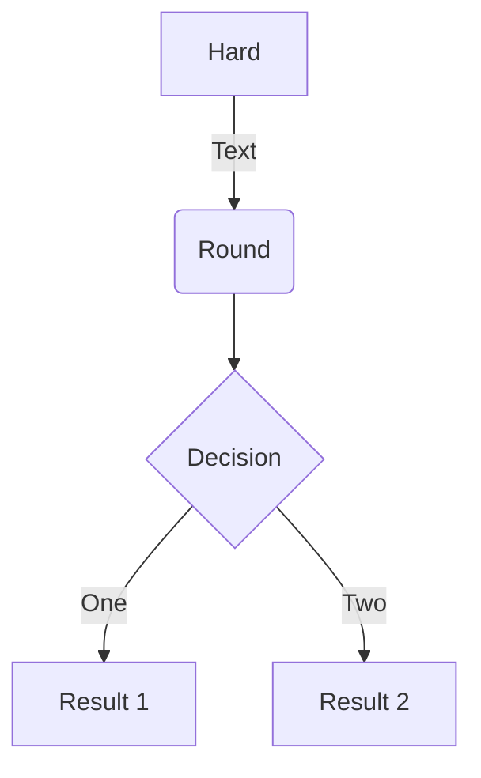

[Old blog](https://leonid-dubinsky.blogspot.com)

See [[Jekyll]], where the sordid saga started.

- ask Obsidian developers to make file moves visible to Git if the vault is a Git repository




## Jekyll finally pissed me off

When I listed TODO link  unresistable to any programmer urge to
write certain kinds of systems, I neglected to mention
a static site generator.

I've been using Jekyll since I migrated my blog from Blogger TODO when;
I then moved my notes from Roam into Obsidian
TODO when link and merged them into the static site with my blog;
that required customizing my Jekyll setup
TODO move Jekyll customization notes into the Jekyll page and link it here.

In March 2026, my site stopped publishing;
error messages were meaningless, and it took a lot of time
to figure out what is the problem by deleting files until it went away.
It turned out that Jekyll plugin I used for handling wiki links TODO link
breaks when an `index` page contains a wiki link (e.g., a [[TODO]]).
Previous communications with the author of the plugin made it clear
that he considers Jekyll to be a legacy system
(but it remained unclear what is the suggested replacement).

At this point, I looked at a few of the modern static site generators
like 11ty TODO link - and decided to write my own ;)

## New Possibilities

It occurred to me that if I write my own site generator,
I can make it Obsidian-aware:

- it can read Obsidian configuration
- it can publish daily notes as dated blog posts

It also occurred to me that I can make alter-rebbe.org TODO link,
a site where I publish some archive documents in the TEI format
static (again) -
if I add support for TEI to my generator:

- link resolution
- facsimiles
- multi-lingual names

It also occurred to me that I can add publishing to X Articles -
if X ever makes an API for that. This would allow me
to own my blog - and at the same time use X ;)

## Farewell, Jekyll

Events of 2026:

- Mar 17: My Jekyll setup (wiki-refs plugin) broke down
- Mar 20: I created my site publisher repository
- I became aware of ZIO Blocks Yaml released on Mar 11 and ZIO Blocks Markdown released on Jan 30
- Mar 22: I filed ZIO Blocks pull request
- Apr 30: I switched my personal website to use my site publisher vis GitHub Actions Workflow
- May 04: I removed all traces of Jekyll from my personal website
- May 06: I became aware of the ZIO Blocks HTML that was added on Apr 25-May 01, and started switching to it from my home-grown HTML DSL
- May 07: switched
- June/July: working on TEI support
- July/August: Asciidoc support and chunking
- Aug 7: PDF generation (with Grok's help)
- Aug 9: switching OpenTorah website from Asciidoctor and Jekyll to site generator

The first milestone for this project is to replace Jekyll on my personal website.
In under two month and a little less than 2000 lines of Scala code,
I have:

- no support for paginating the post list, which I did not use with Jekyll anyway;
- instead of the Ruby code highlighter Rouge, my publisher uses Highlights.js; it loads only the language modules used in the page; TODO unsupported language mapping...

- while I did manage to list children pages using Jekyll,
I never figured out how to list subdirectories;
with my own publisher this is not a problem ;)

- Jekyll ignores Markdown files without front matter; I do not;
- wiki links
- link resolution
- front-matter defaults auto-added pages;
- header pages are configured in their frontmatter, with FA icons (and defaults) ;)
- transclusion
- directory navigation: up, prev, next;
- path navigation;
- insertion of missing index pages;

Write about all the plugins I used:

- jekyll-optional-front-matter
- jekyll-sitemap
- jekyll-feed
- jekyll-mentions
- jekyll-avatar
- jekyll-wikirefs

## Design

Opinionated, because I am writing this for myself:

- everything is written in Scala
- no plugins
- no SCSS
- no template languages
- no layouts

The layout is Minima-inspired CSS and HTML, not a Jekyll theme engine.

Code lives in `site-publisher`. Dialect conversion sits next to `XxxMarkup`; shared IR and resolution sit in `markup/` (`Citation`, `Bibliography`, `Footnote`, `Glossary`, `Section`, …). There is no `feature/` package.

### Pipeline

`Site` coordinates. `Pages` scans the source tree and builds the page graph, including synthetic pages (`/posts`, `/tags`, `/errors`, `sitemap.xml`, …).

Per document:

1. Dialect `Markup` (`md` / `adoc` / `html` / `tei`) plus `FrontMatter` → `Xml.Element`
2. Dialect converters emit shared IR
3. `PageContent.apply` prepares once: sections/ids, internal-link marks, wiki embed, footnote harvest
4. `PageContent.markupContent` resolves per chunk: select XML, append referenced footnotes, resolve citations, resolve links and tooltips, inject TOC
5. Minima-inspired HTML → write (`textContent` or copy assets)

`.xml` files are disambiguated by root element (`TEI`, …).

### Markup

Supported: [[Markdown]], [[AsciiDoc]], HTML, [[TEI]].

Considered: [[DocBook]], ReStructured Text.

Cross-markup transclusion means stylesheets (and MathJax etc.) are included even when a page’s source dialect would not need them — unless we later compute the set of markups actually used.

### Front matter

Internal (in the markup file) or external (same name, `.yaml` / `.yml`). Both present is an error.

A file is markup if its extension is associated with a dialect (`.md`, `.adoc`, …) or it is `.xml` whose root element is associated with a dialect. TODO: front-matter boolean `asset` to declare that a file is *not* markup.

[[Jekyll]] ignored Markdown without front matter; this publisher does not.

### Page names and wiki links

[[Jekyll]] used front-matter titles and ignored file names; I needed an Obsidian plugin to copy names into titles. This publisher uses both file name and front-matter title for link resolution, so the title property is only needed when it differs from the file name.

Obsidian uses file names and ignores the front-matter title; a plugin would be needed for the reverse.

Wiki links (`[[…]]`), internal link resolution, backlinks, aliases (TODO). Open questions about Obsidian wiki links: case sensitivity, file name vs title vs document title, ambiguous names, line wrapping, agglutination.

### Directories and posts

Directory pages, navigation (up/prev/next), path navigation, missing index pages, header pages with FA icons from front matter.

Posts: `_posts/`, `_drafts/`, Obsidian daily-notes folder (from `.obsidian`). Auto-post vs permalink. Filename convention `YYYY-MM-DD-title`. `_posts` is emptied out of the directory listing (`Posts.isDirectoryEmptiedOut`).

### Chunking

I used `asciidoctor-multipage` [extension](https://github.com/owenh000/asciidoctor-multipage) to split AsciiDoc into per-section HTML. It has long-known [issues](https://github.com/owenh000/asciidoctor-multipage/issues/46), (footnotes) and only works for AsciiDoc.

The publisher chunks any supported markup. The term is `chunking` (DocBook XSLT), not `multi-page`.

### Sections and TOC

Canonical IR: nested `div.section` with a heading (HTML `hN` nested after convert; TEI already nested, heading is `tei-head`). Permalinks and missing ids are added on that IR (`Section.normalize`). `xml:id` is copied to `id`. TOC walks through non-section wrappers; a heading need not be the first child (`pb`/`fw` before `head`).

Kramdown `{:toc}` is a TOC placeholder in Markdown.

### Footnotes

IR: stub `span.footnote-link` with `footnoteCorrelationId`; body `span.footnote` with the same id. Harvest numbers in document-link order, strip bodies, append referenced bodies after chunk select, turn stubs into numbered `<a>`s.

Tooltips: `Tip.attachTip` returns `span.footnote-ref` containing the `<a>` and `span.footnote-tip` as siblings. Recurse only into the tip (`attachTips = false`) so links in the note resolve without nested tips.

AsciiDoc leftover `div#footnotes` and Markdown `div.footnotes` are stripped as spurious containers.

### Task lists

IR is GFM-shaped, not FlexMark or Asciidoctor soup:

```html
<ul class="task-list">
  <li class="task-list-item">
    <input type="checkbox" class="task-list-item-checkbox" disabled checked>
    item text
  </li>
</ul>
```

`TaskList` is IR only (classes, `checkbox` / `asItem` / `asList`). Markdown leftovers (FlexMark `li.task-list-item`, checkbox, `&nbsp;`) convert in `MarkdownMarkup`. AsciiDoc leftovers (`ul.checklist`; default html5 `✓`/`❏`, `%interactive` `<input>`, `icons=font` Font Awesome) convert in `AsciiDocMarkup.cleanup`. Mixed lists: only task items get `task-list-item`; the parent gets `task-list` if it has any. CSS in `layout.css` styles only these classes. HTML that is already IR is left alone.

### Glossary

Harvested from markup-neutral HTML: `class="glossary"` on the list, `class="glossary-item"` with an `id` on each term. Links to those ids get definition tooltips (`span.glossary-ref` / `span.glossary-tip`), same `Tip` as footnotes. Print and `html.glossary-expand` inline the definition in parentheses.

Term id is the `id` on `<dt>` if present, otherwise the term text with spaces turned into hyphens (`Alter Rebbe` → `Alter-Rebbe`).

### Bibliography

Dialect syntax → `Citation` IR (`span.citation` / `span.citation-item` with `data-key`, optional `data-locator`, `data-mode`; `div.bibliography` placeholder). Then a **per-document** BibTeX file plus citeproc-java (CSL). No site-level bibliography file or style; both `bibliography` and `csl` are required on the document’s front matter. Locale is page `lang`, else site `lang`, else `en-US`.

Cited-only list. Unknown keys → `span.unresolved-citation` and a page error (not reported on chunks). Resolved in-text cites become `a.citation` linking to `#bibl-{key}` on the matching `csl-entry` (first key if several).

AsciiDoc: Java extensions (`cite`, `citenp`, `bibliography::[]`); no Ruby gem. The inline-macro regexp allows an empty target so `cite:[key]` matches; positional attributes are all joined (not just `1`).

Markdown: Pandoc citation syntax scanned after FlexMark; no extra extension.

### PDF

Markup-independent. TODO details.

### Still wanted (markup-independent)

Admonitions, asides, callouts. TEI: footnotes clinging to preceding elements, facsimiles, raw TEI. Categories as wiki links; auto category/tag pages. Paging long lists. CLI package, watch, publish to a bucket.
